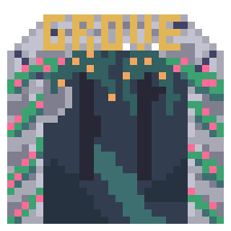

# Book Hub

## About the Project

Introducing Book Hub! A website primarily designed to pertain to the readers of a fictional library called The Book Hub, but it delves into much more depth than just being a website for the library, and has so much more to offer to its users.

### Codex

Powered with the help of Google Books API, scour the internet for millions of books and find the right ones for you. Offering a method to search using the title but also giving the ability to look up information using a book's ISBN, authors, publishers, and even its genre/category. Each result available has its own result page, containing detailed information that combines both the results from the Google Books API and the thoughts and opinions of the Book Hub community.

### Book Crate

The library provides a plethora of books available for sale. Hence, the Book Crate was created as a platform to do so where admins/librarians can add/delete/update listings to be made available to the users providing the stock and price (Credits are used as the currency for monetary transactions. Purely fictional in nature. Not representative of real currency.). Users can search among the available listings using similar parameters to the Codex search system and either purchase books immediately or add them to their cart and save them for later.

However, since at the base, Book Hub is a library thus, it is open to book donations from its community members. Users can make a request to donate books through the book crate. If accepted, they'll get one credit per book donated.

Invoices are generated and provided for each transaction in relation to the user, whether it be a purchase or an accepted/rejected donation request, complete with book information, listing information, transaction amount, and timestamp, available for viewing on the user's profile at Reader's Grove.

### Reader's Grove

A community needs an area to convene and discuss. Reader's Grove does the same, serving as a networking area for all members, complete with showing ratings & reviews from across the community on various books as well as a more controlled approach where users can see the ratings & reviews of people they have bookmarked (A bookmark is essentially a following system).

Another core feature is a user's bookshelf. As and when users come across book results on the website, in addition to rating and/or reviewing them, they can also add them to their bookshelf under the tag "Read", "Currently Reading", and "Want to Read" which will later be shown on the user's profile with a backdrop of a bookshelf to evoke the image of an actual book present on a bookshelf.

Finally, the base profile section of the user provides an about section, and a shorthand view of what they are currently reading or what they want to read, alongside numerical data on their bookshelves, ratings, reviews, and bookmarks.

## How to run the Project

The project requires Python with the modules: django, re, requests, and json.
Additionally, the project also requires npm and Vite to be available.
Once all requirements are in place, do the following:

### 1. Running the Back-End

Open a Terminal Window and run the following commands in order:

python manage.py makemigrations

python manage.py migrate

python manage.py runserver

### 2. Running the Front-End

Open another Terminal Window and change the directory into the frontend folder and run the following commands in order:

npm install

npm run dev

Then click on the corresponding link on the Terminal window to view and explore the project.

Note:
Do not close either terminal while the project is running — both the backend and frontend must be active.
